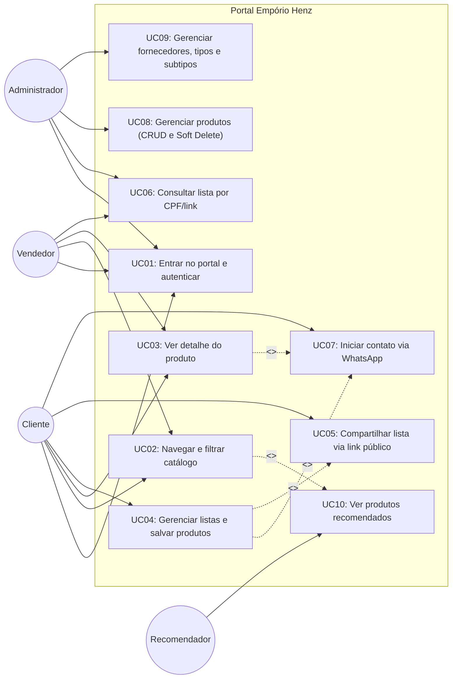
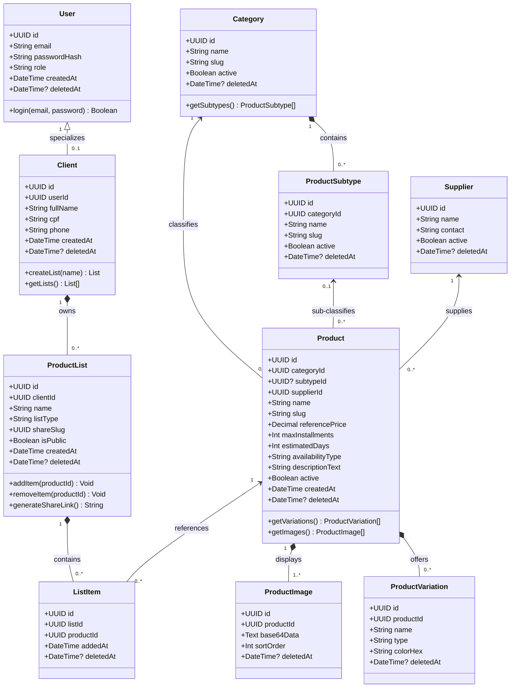
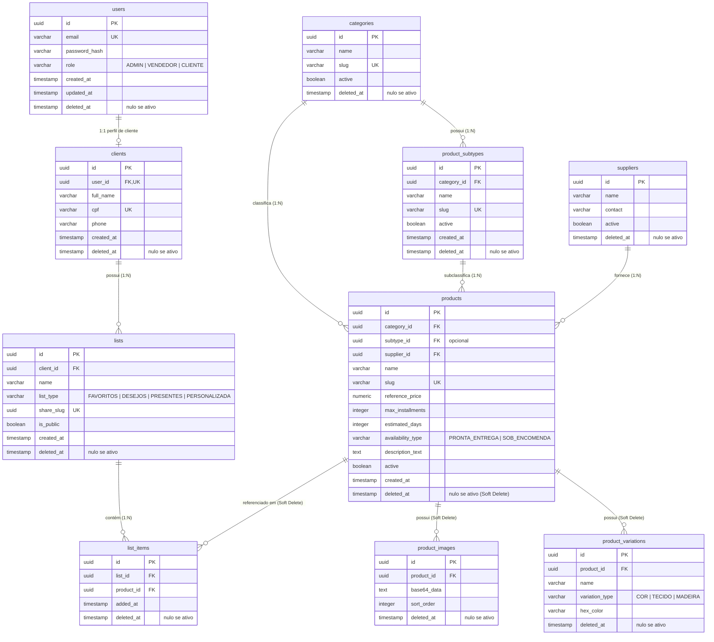

# PRD · Portal Empório Henz

_Loja de móveis online e catálogo digital com solicitação de compra via WhatsApp_

_Stack: Bun + TypeScript (back-end) · Vue 3 + Vite + Tailwind CSS (front-end) · PostgreSQL (banco de dados)_

---

## 1. Problema

A Empório Henz é uma tradicional loja familiar de móveis e materiais em Cruzeiro do Sul (RS), com mais de 50 anos de história e forte relação de confiança com a comunidade local. Em maio de 2024, as enchentes históricas que atingiram o Rio Grande do Sul destruíram o estoque físico da loja e forçaram dezenas de famílias e clientes a se mudarem para outros bairros e municípios vizinhos da região dos Vales (como Lajeado, Estrela e arredores), afastando geograficamente a base de clientes do ponto físico.

Quem perde com isso, e como:

- **A loja física**: opera com espaço físico reduzido após a reconstrução e não dispõe de área de salão suficiente para expor todo o acervo e a variedade de móveis disponíveis junto aos seus parceiros e fabricantes.
- **Os clientes tradicionais que se mudaram**: perderam o contato diário e presencial com a loja física e não sabem quais linhas e produtos a Empório Henz continua fornecendo.
- **Consumidores finais**: têm receio natural de comprar mobiliário em catálogos digitais "às cegas", sem poder inspecionar pessoalmente a solidez dos materiais, tecidos, acabamentos, dimensões reais e as garantias de montagem profissional.
- **Profissionais (arquitetos e designers de interiores)**: não contam com uma ferramenta prática e centralizada para selecionar móveis por projeto/ambiente, montar listas e apresentar opções visuais para a aprovação direta de seus clientes.
- **A equipe de vendas presencial**: ao atender clientes na loja física (inclusive clientes que se deslocaram de cidades vizinhas), depende de catálogos impressos dispersos ou mensagens desestruturadas, em vez de uma ferramenta rápida em tablet para consultar o portfólio completo e resgatar as listas e preferências que o cliente já pesquisou previamente.

## 2. Solução

Uma plataforma web moderna, fluida e responsiva (otimizada para desktop, celular e tablets de atendimento) que digitaliza e expande o catálogo da Empório Henz, conectando o portfólio completo de pronta entrega e sob encomenda ao atendimento humanizado da loja.

Principais pilares da solução:

1. **Catálogo Digital Completo**: navegação por categorias de ambientes, busca por texto, filtros por faixa de preço de referência, materiais, cores e disponibilidade (itens disponíveis na loja física para pronta entrega ou sob encomenda com estimativa de prazo em dias).
2. **Detalhamento Rico com Confiança em Materiais**: fichas de produtos com carrossel de fotos em alta resolução, variações de acabamento, especificações técnicas detalhadas em texto estruturado e um **card/convite oficial convidando o cliente a visitar o showroom físico** da Empório Henz em Cruzeiro do Sul para ver e tocar nas amostras de materiais e tecidos.
3. **Listas de Produtos Estruturadas e Pastas Compartilháveis**: o cliente cria sua conta (com e-mail e CPF) e pode organizar produtos em três listas padronizadas — **Favoritos**, **Lista de Desejos** e **Lista de Presentes** (casamento/chá de casa nova) —, além de pastas personalizadas por ambiente ou projeto (ex.: "Apto 302 - Sala"). As listas podem ser compartilhadas publicamente com qualquer pessoa via link exclusivo somente-leitura.
4. **Atendimento Presencial Conectado via CPF ou Link**: a equipe interna (Administrador e Vendedores) tem acesso a uma interface administrativa otimizada para tablets na loja física, onde pode consultar as listas salvas de um cliente buscando diretamente pelo **CPF** do cliente ou pelo link compartilhado, agilizando o atendimento presencial.
5. **Fechamento de Venda Contextualizado no WhatsApp**: o cliente não efetua pagamento no portal; ao decidir comprar, aciona o botão do WhatsApp, que abre a conversa com a loja já com uma mensagem pré-formatada contendo os dados exatos do produto selecionado (nome, acabamento escolhido, preço e link) ou da lista completa de itens, preservando a negociação comercial próxima e personalizada.

## 3. Escopo

O sistema é estruturado em partes evolutivas na ordem abaixo. Cada etapa estabelece as fundações necessárias para a seguinte:

| Ordem | Parte                                                                                                                                      | Por que nesta posição                                                                                               |
| ----- | ------------------------------------------------------------------------------------------------------------------------------------------ | ------------------------------------------------------------------------------------------------------------------- |
| 1     | Autenticação, perfis de acesso e cadastro de usuários (Admin, Vendedor, Cliente com CPF)                                                   | Sem identificação de usuários não é possível diferenciar permissões nem associar listas aos clientes                |
| 2     | Catálogo público: navegação, busca e filtros (pronta entrega e sob encomenda com prazo em dias)                                            | É o coração da plataforma que resolve a descoberta de produtos para os clientes                                     |
| 3     | Página de detalhe do produto (galeria de fotos, variações, preço de referência, política regional de entrega/montagem e convite de visita) | É onde o cliente final e o arquiteto avaliam a qualidade, dimensões e confiabilidade do móvel                       |
| 4     | Gestão de listas do cliente (Favoritos, Lista de Desejos, Lista de Presentes e pastas personalizadas)                                      | Permite ao usuário reter itens de interesse, comparar opções e planejar suas compras                                |
| 5     | Compartilhamento público de listas (link único somente-leitura) e consulta de listas por CPF no atendimento                                | Atende aos arquitetos apresentando para clientes e permite aos vendedores consultar listas no tablet da loja física |
| 6     | Disparo contextualizado de WhatsApp (do produto individual e da lista de itens)                                                            | É o canal que converte o interesse do cliente em venda real junto aos atendentes da loja                            |
| 7     | Painel administrativo do catálogo (CRUD de produtos, desativação/soft delete, categorias e fornecedores)                                   | Garante a manutenção e atualização autônoma do catálogo pela equipe da loja                                         |
| 8     | Recomendações de produtos no catálogo                                                                                                      | Enriquecimento que sugere itens complementares com base nas categorias visualizadas                                 |

## 4. Requisitos funcionais

| ID   | Requisito                                                                                                                                                                                                                                                                                                                                                                                                                                                                                                                                                    |
| ---- | ------------------------------------------------------------------------------------------------------------------------------------------------------------------------------------------------------------------------------------------------------------------------------------------------------------------------------------------------------------------------------------------------------------------------------------------------------------------------------------------------------------------------------------------------------------ |
| RF01 | O sistema permite autenticação por e-mail e senha com controle de perfis: **Administrador**, **Vendedor** e **Cliente**.                                                                                                                                                                                                                                                                                                                                                                                                                                     |
| RF02 | O sistema permite ao Administrador cadastrar e atualizar produtos com: nome, tipo/categoria principal, subtipo vinculado, fornecedor associado, preço de referência à vista, parcelamento sugerido, prazo estimado em dias, tipo de disponibilidade (**Pronta entrega** na loja física ou **Sob encomenda**), imagens salvas no banco em formato Base64, opções de variações de acabamento (cores/tecidos/madeiras) e um campo amplo de texto livre formatado para especificações técnicas, medidas (largura, altura, profundidade), composição e ferragens. |
| RF03 | O sistema permite ao Administrador desativar produtos do catálogo através de exclusão lógica (**Soft Delete**, preenchendo o campo `deleted_at`); produtos desativados deixam de ser listados nas buscas públicas do catálogo imediatamente e são ocultados das listagens ativas de listas/pastas de clientes, sem nunca executar exclusão física (`DELETE`) do registro no banco de dados.                                                                                                                                                                  |
| RF04 | O sistema permite ao Administrador cadastrar, editar e desativar fornecedores, tipos/categorias principais (ex.: Sala de Estar, Jantar, Quarto, Cozinha, Escritório, Banheiro, Decoração) e **subtipos vinculados** (ex.: Sofá, Poltrona, Rack/Painel, Mesa de Centro; Cama, Guarda-Roupa, Cômoda, Mesa de Cabeceira), com controle de status ativo/inativo e soft delete.                                                                                                                                                                                   |
| RF05 | O sistema exibe o catálogo público com paginação/rolagem, busca textual por nome/descrição e filtros combinados por tipo (categoria principal), subtipo, faixa de preço, tipo de disponibilidade (pronta entrega ou sob encomenda), cor/acabamento e fornecedor.                                                                                                                                                                                                                                                                                             |
| RF06 | O sistema exibe a página de detalhe do produto com: carrossel de fotos, seletor de variações de acabamento, valor à vista e simulação de parcelamento sugerido (deixando claro que é preço de referência sujeito a negociação), prazo estimado de fabricação/entrega em dias, política informativa sobre entrega e montagem regional (com indicação de atendimento prioritário em Cruzeiro do Sul e Lajeado), especificações técnicas completas e um card convidando o cliente a visitar o showroom físico para tocar nas amostras de materiais.             |
| RF07 | O sistema permite o autocadastro do Cliente informando nome, e-mail, senha e **CPF** válido.                                                                                                                                                                                                                                                                                                                                                                                                                                                                 |
| RF08 | O sistema disponibiliza para cada cliente 3 listas padronizadas automáticas (**Favoritos**, **Lista de Desejos** e **Lista de Presentes**), além de permitir a criação, renomeação e exclusão de pastas personalizadas livres.                                                                                                                                                                                                                                                                                                                               |
| RF09 | O sistema permite ao cliente adicionar ou remover produtos em qualquer uma de suas listas/pastas a partir do catálogo ou da página de detalhe do produto.                                                                                                                                                                                                                                                                                                                                                                                                    |
| RF10 | O sistema permite gerar um link público exclusivo (baseado em UUID) para qualquer lista ou pasta do cliente; qualquer visitante que possuir o link acessa a lista em modo somente-leitura, sem exibir dados confidenciais do cliente criador.                                                                                                                                                                                                                                                                                                                |
| RF11 | O sistema disponibiliza para o Administrador e Vendedor uma tela de consulta interna de listas para atendimento, permitindo buscar e visualizar as listas de um cliente através do seu **CPF** ou pelo link compartilhado da lista.                                                                                                                                                                                                                                                                                                                          |
| RF12 | O sistema exibe na página de detalhe do produto e nas listas salvas um botão de contato via WhatsApp que gera automaticamente uma mensagem pré-preenchida contendo: nome do produto, variação/acabamento selecionado, preço de referência e link da página (ou, no caso da lista, nome da lista, link público e relação dos itens selecionados).                                                                                                                                                                                                             |
| RF13 | O sistema exibe páginas institucionais com a história de 50 anos da Empório Henz, fotos do showroom pós-reconstrução, endereço em Cruzeiro do Sul, horário de funcionamento e canais de atendimento.                                                                                                                                                                                                                                                                                                                                                         |
| RF14 | O sistema sugere produtos relacionados e recomendados no catálogo e no rodapé da página de produto com base na mesma categoria ou em categorias complementares.                                                                                                                                                                                                                                                                                                                                                                                              |

## 5. Requisitos não funcionais

| ID    | Requisito                                                                                                                                                                                                                                                                                                                                                | Como se verifica                                                                                                                                                                                                                 |
| ----- | -------------------------------------------------------------------------------------------------------------------------------------------------------------------------------------------------------------------------------------------------------------------------------------------------------------------------------------------------------- | -------------------------------------------------------------------------------------------------------------------------------------------------------------------------------------------------------------------------------- |
| RNF01 | O catálogo com filtros combinados responde e renderiza em até 2 segundos em conexões padrão com até 500 produtos cadastrados                                                                                                                                                                                                                             | Medição de tempo de resposta da API e carregamento no DevTools do navegador                                                                                                                                                      |
| RNF02 | As imagens de produtos enviadas em Base64 são comprimidas e limitadas a no máximo 1 MB por imagem antes da persistência no banco PostgreSQL                                                                                                                                                                                                              | Tentativa de upload de imagem bruta de alta resolução com validação do payload e do tamanho armazenado                                                                                                                           |
| RNF03 | Senhas de usuários e clientes são obrigatoriamente criptografadas com hash seguro (Argon2 ou bcrypt) antes de persistir no banco                                                                                                                                                                                                                         | Inspeção direta dos registros da tabela de credenciais no banco PostgreSQL                                                                                                                                                       |
| RNF04 | **Requisito Crítico**: Um cliente nunca consegue visualizar ou alterar listas/pastas de outro cliente sem possuir o link público de compartilhamento gerado. O acesso da equipe interna de vendas às listas de um cliente depende da busca intencional por CPF informado pelo cliente para atendimento                                                   | Tentativa de requisição direta a endpoints protegidos de listas via URL com tokens de outros clientes                                                                                                                            |
| RNF05 | A interface do portal é responsiva e adaptável para telas a partir de 360px (smartphones) até 1024px+ (incluindo tablets em orientação retrato e paisagem para uso no balcão da loja física)                                                                                                                                                             | Testes no navegador com emulação de dispositivos móveis e tablets                                                                                                                                                                |
| RNF06 | A aplicação roda nos principais navegadores modernos (Google Chrome, Mozilla Firefox, Safari, Microsoft Edge) sem necessidade de plugins proprietários                                                                                                                                                                                                   | Validação cruzada de navegação e layouts nos browsers indicados                                                                                                                                                                  |
| RNF07 | A API do backend em Bun é estruturada em rotas REST versionadas (`/api/v1/...`) respondendo em formato JSON com códigos de status HTTP semânticos (200, 201, 400, 401, 403, 404, 500)                                                                                                                                                                    | Inspeção das respostas e testes de integração com ferramentas HTTP/cURL                                                                                                                                                          |
| RNF08 | O banco de dados relacional PostgreSQL adota estratégia estrita de **Soft Delete** (`deleted_at timestamp`, nulo para registros ativos e preenchido na exclusão lógica) em todas as entidades (produtos, categorias, fornecedores, listas), assegurando integridade histórica e de auditoria, sem nunca executar exclusão física (`DELETE`) de registros | Tentativa de exclusão de produto/registro pelo painel e verificação no PostgreSQL de que a linha permanece persistida com `deleted_at` preenchido e que as consultas públicas filtram automaticamente `WHERE deleted_at IS NULL` |

O **RNF04** é o requisito crítico do sistema: assegura que as pastas, projetos de arquitetos e intenções de compra dos clientes permaneçam estritamente privadas, protegendo a privacidade dos usuários e a confidencialidade dos projetos de especificação de arquitetura.

## 6. Histórias de usuário

1. **Como consumidora final (ex.: Laura)**, quero navegar pelo catálogo online da loja com fotos nítidas e detalhes claros de pronta entrega ou prazo sob encomenda, para poder mobiliar minha casa após ter me mudado de cidade sem precisar ir à loja às cegas.
2. **Como consumidora final**, quero ver a simulação de valores à vista e parcelados com explicações sobre montagem e entrega na minha cidade, para entender as condições antes de entrar em contato para fechar a compra.
3. **Como consumidora final**, quero salvar móveis de interesse em listas padrão como "Favoritos", "Lista de Desejos" ou "Lista de Presentes", para organizar as ideias de decoração e compartilhar com minha família.
4. **Como arquiteto/designer (ex.: Henrique)**, quero criar pastas personalizadas por projeto (ex.: "Reforma Sala Estar - Cliente Carlos") e gerar um link compartilhável somente-leitura, para apresentar ao meu cliente as opções de móveis da loja selecionadas especificamente para o projeto dele.
5. **Como cliente (consumidor ou arquiteto)**, quero clicar em um botão de WhatsApp no produto ou na minha lista de desejos e enviar uma mensagem formatada com os links e acabamentos escolhidos, para negociar diretamente com os atendentes da loja de forma rápida.
6. **Como cliente presencial**, quero chegar na loja física em Cruzeiro do Sul e informar meu CPF ao vendedor, para que ele visualize no tablet as listas de produtos que salvei em casa e me guie pelo showroom e pelas amostras de materiais.
7. **Como vendedor da loja**, quero acessar uma tela de consulta no tablet e buscar as listas do cliente por CPF ou link, para prestar um atendimento ágil e personalizado mostrando as amostras de tecidos e acabamentos correspondentes.
8. **Como administradora da loja (Empório Henz)**, quero cadastrar e atualizar produtos com fotos em Base64, prazo em dias, variações e descrições detalhadas, para manter o mostruário digital sempre alinhado aos fornecedores.
9. **Como administradora da loja**, quero desativar do catálogo produtos descontinuados via exclusão lógica (soft delete), para evitar que clientes comprem itens que não podem mais ser fabricados sem perder o histórico do produto no banco.

## 7. Casos de uso

### Atores

| Ator          | Quem é                                                                                                                                      |
| ------------- | ------------------------------------------------------------------------------------------------------------------------------------------- |
| Cliente       | O consumidor final ou profissional (arquiteto/designer) que navega no catálogo, salva produtos em listas e aciona o WhatsApp para compra    |
| Vendedor      | O colaborador da loja física que utiliza o tablet no showroom para consultar listas de clientes por CPF ou link e apoiar a venda presencial |
| Administrador | A gerência da Empório Henz, responsável por cadastrar produtos, categorias, fornecedores, gerenciar equipe e manter o catálogo              |
| Recomendador  | O próprio sistema web, que sugere itens relacionados e complementares com base nas categorias navegadas                                     |

### Casos de uso e rastreabilidade

| Caso de uso                                                     | Vem da história            | Realiza    |
| --------------------------------------------------------------- | -------------------------- | ---------- |
| UC01 · Entrar no portal e autenticar                            | Nenhuma (pré-requisito)    | RF01, RF07 |
| UC02 · Navegar e filtrar catálogo público                       | 1                          | RF05       |
| UC03 · Ver detalhe do produto e política de entrega/montagem    | 1, 2                       | RF06       |
| UC04 · Gerenciar listas e salvar produtos                       | 3, 4                       | RF08, RF09 |
| UC05 · Compartilhar lista via link público                      | 4                          | RF10       |
| UC06 · Consultar lista de cliente por CPF/link (Equipe da loja) | 6, 7                       | RF11       |
| UC07 · Iniciar contato de compra via WhatsApp                   | 5                          | RF12       |
| UC08 · Gerenciar produtos do catálogo (CRUD e Soft Delete)      | 8, 9                       | RF02, RF03 |
| UC09 · Gerenciar fornecedores, tipos e subtipos                 | 8                          | RF04       |
| UC10 · Ver produtos recomendados                                | Nenhuma (extensão de UC02) | RF14       |

### Diagrama de casos de uso

---

### Detalhamento dos Casos de Uso com Regras de Negócio

#### UC04 · Gerenciar listas e salvar produtos

| Campo              | Conteúdo                                                                                                |
| ------------------ | ------------------------------------------------------------------------------------------------------- |
| Ator principal     | Cliente                                                                                                 |
| Pré-condição       | Cliente autenticado no portal                                                                           |
| Disparo            | O cliente clica no ícone de salvar em um produto (no card ou detalhe) ou acessa a seção "Minhas Listas" |
| Requisitos ligados | RF08, RF09, RNF04                                                                                       |

Fluxo principal:

1. O cliente acessa a área "Minhas Listas" e visualiza suas listas ativas (já inicializadas com **Favoritos**, **Lista de Desejos** e **Lista de Presentes**).
2. O cliente pode criar uma nova pasta personalizada informando um nome (ex.: "Móveis Quarto Casal").
3. Na navegação do catálogo ou na página de detalhe de um produto, o cliente clica no botão "Salvar".
4. O sistema exibe um modal listando as opções de destino (as 3 listas padrão e eventuais pastas personalizadas).
5. O cliente escolhe a lista de destino e confirma.
6. O sistema associa o produto à lista do cliente e apresenta feedback visual de confirmação.
7. O cliente pode renomear ou remover pastas personalizadas criadas por ele.

Fluxos alternativos:

- **A1, Cliente não autenticado**: Ao clicar em salvar, o sistema abre modal convidando o cliente a entrar ou se cadastrar com e-mail e CPF, preservando o produto selecionado em memória para salvar logo após a autenticação.
- **A2, Produto já presente na lista**: O sistema informa que o item já está cadastrado naquela lista e permite mantê-lo ou transferi-lo para outra pasta.
- **A3, Tentativa de exclusão das listas padrão**: O sistema impede a exclusão das listas "Favoritos", "Lista de Desejos" e "Lista de Presentes"; o cliente pode remover itens de dentro delas, mas os contêineres padrão são permanentes.

Pós-condição: O produto permanece associado à lista escolhida e pode ser recuperado a qualquer momento em novos acessos.

---

#### UC06 · Consultar lista de cliente por CPF ou link (Equipe da Loja)

| Campo              | Conteúdo                                                                                            |
| ------------------ | --------------------------------------------------------------------------------------------------- |
| Ator principal     | Vendedor ou Administrador                                                                           |
| Pré-condição       | Usuário interno autenticado com perfil de Vendedor ou Administrador (ex.: em tablet na loja física) |
| Disparo            | O vendedor acessa a tela administrativa de "Atendimento ao Cliente / Listas"                        |
| Requisitos ligados | RF11, RNF04, RNF05                                                                                  |

Fluxo principal:

1. O vendedor solicita o CPF do cliente em atendimento presencial na loja física.
2. O vendedor digita o número do CPF no campo de busca da tela de atendimento.
3. O sistema valida o formato do CPF e busca os dados do cliente e suas listas cadastradas (Favoritos, Lista de Desejos, Lista de Presentes e pastas personalizadas).
4. O sistema lista na tela do tablet os nomes das listas e a quantidade de itens em cada uma.
5. O vendedor clica em uma lista para visualizar os produtos salvos, fotos, variações selecionadas e valores de referência.
6. O vendedor utiliza as informações para guiar o cliente pelo showroom físico e apresentar as amostras de tecidos e madeiras reais correspondentes.

Fluxos alternativos:

- **A1, CPF não encontrado no sistema**: O sistema exibe mensagem informando que não há cadastro com aquele CPF e oferece ao vendedor a opção de buscar por link público compartilhado ou orientar o cliente a se cadastrar.
- **A2, Cliente sem itens salvos**: O sistema exibe o perfil do cliente confirmando o cadastro, mas indica que as listas estão vazias no momento.
- **A3, Consulta via link público**: O cliente apresenta ao vendedor o link que enviou via WhatsApp; o vendedor insere o código/link e a lista é carregada diretamente em modo de atendimento.

Pós-condição: A equipe da loja visualiza os produtos de interesse do cliente para prestar consultoria e conduzir a negociação.

---

#### UC07 · Iniciar contato de compra via WhatsApp

| Campo              | Conteúdo                                                                             |
| ------------------ | ------------------------------------------------------------------------------------ |
| Ator principal     | Cliente                                                                              |
| Pré-condição       | Cliente na página de detalhe de um produto ou visualizando uma de suas listas/pastas |
| Disparo            | O cliente clica no botão "Comprar pelo WhatsApp" ou "Enviar Lista para a Loja"       |
| Requisitos ligados | RF06, RF10, RF12                                                                     |

Fluxo principal (a partir da página de detalhe do produto):

1. O cliente escolhe a variação desejada do móvel (ex.: "Tecido Linho Bege / Madeira Imbuia").
2. O cliente clica no botão "Comprar pelo WhatsApp".
3. O sistema formata a mensagem contendo: nome do móvel, acabamento escolhido, preço de referência exibido no site e a URL direta do produto.
4. O sistema gera a URL de direcionamento no padrão `https://wa.me/{numero_loja}?text={mensagem_codificada}` e aciona a abertura do aplicativo WhatsApp Web ou Mobile.
5. O cliente envia a mensagem e inicia o atendimento humanizado com a equipe da Empório Henz para negociar prazo real, forma de pagamento e frete.

Fluxo alternativo (a partir de uma lista ou pasta salva):

- **A1, Envio da lista completa**: O cliente clica em "Solicitar orçamento da lista no WhatsApp". O sistema garante que a lista possui link público ativo, compõe a mensagem contendo o nome da lista, o link público para visualização pela loja e a relação resumida dos produtos.

Pós-condição: A conversa no WhatsApp é iniciada com todas as referências do produto ou da lista prontas para a equipe da loja responder.

---

#### UC08 · Gerenciar produtos do catálogo (CRUD e Soft Delete)

| Campo              | Conteúdo                                                                                                 |
| ------------------ | -------------------------------------------------------------------------------------------------------- |
| Ator principal     | Administrador                                                                                            |
| Pré-condição       | Administrador autenticado no painel administrativo                                                       |
| Disparo            | O administrador clica em "Cadastrar Novo Produto", "Editar" ou "Desativar/Excluir" no painel de produtos |
| Requisitos ligados | RF02, RF03, RNF02, RNF08                                                                                 |

Fluxo principal (Cadastro/Edição):

1. O administrador acessa a listagem administrativa de produtos e seleciona "Novo Produto" ou "Editar".
2. Preenche os campos obrigatórios: Nome, Categoria, Fornecedor, Preço de Referência, Parcelamento Sugerido, Prazo Estimado (em dias) e Disponibilidade (**Pronta entrega** ou **Sob encomenda**).
3. Seleciona arquivos de imagem locais; o sistema converte os arquivos em strings Base64 otimizadas e pré-visualiza no formulário.
4. Cadastra as opções de variação (cores/acabamentos disponíveis) e preenche a descrição em área de texto livre formatada com medidas e ferragens.
5. O administrador clica em "Salvar". O sistema valida os campos obrigatórios e grava o registro no PostgreSQL.

Fluxo alternativo (Exclusão lógica de produto / Soft Delete):

- **A1, Exclusão de produto (Soft Delete)**: O administrador aciona a ação "Excluir" em um produto descontinuado e confirma a desativação.
- O sistema executa a exclusão lógica (**Soft Delete**), gravando o timestamp atual no campo `deleted_at` do produto no PostgreSQL, sem nunca disparar a remoção física (`DELETE`) do registro.
- O produto deixa de aparecer instantaneamente nas buscas do catálogo público e nas consultas ativas, e o histórico de referências passadas é preservado com total integridade.

Pós-condição: O produto é atualizado ou marcado como logicamente excluído (`deleted_at` preenchido) no banco de dados, sem exclusão física de registros.

## 8. Modelagem

### 8.1 Diagrama de Classes

---

### 8.2 Modelo de Dados (DER Relacional para PostgreSQL)

## 9. Decisões de implementação

- **Back-end em Bun nativo com TypeScript**: utiliza `Bun.serve` para alta performance, rotas modulares e tipagem estrita com TypeScript, mantendo a arquitetura limpa e sem dependências pesadas de frameworks externos.
- **Front-end em Vue 3 + Vite + Tailwind CSS**: arquitetura com Single File Components (SFCs), gerenciamento de estado com Pinia (autenticação, listas e filtros do catálogo) e roteamento limpo com Vue Router.
- **Banco de Dados Relacional PostgreSQL**: utilizado para garantir integridade referencial estrita, transações e relacionamento entre clientes, listas e produtos.
- **Imagens em Base64 no Banco**: as fotos dos produtos são salvas diretamente no PostgreSQL como strings em Base64 (campo `text`). Para prevenir degradação de performance e sobrecarga no tráfego, as imagens passam por compressão client-side ou server-side antes do salvamento, limitadas a 1 MB por arquivo.
- **Exclusão Lógica Obrigatória (Soft Delete)**: nenhuma operação no sistema executa deleção física (`DELETE`). Todas as tabelas contam com a coluna `deleted_at` (timestamp, nulo para registros ativos). Ao desativar ou remover produtos, categorias, fornecedores ou listas, o sistema preenche `deleted_at = NOW()`. O backend aplica automaticamente a cláusula `WHERE deleted_at IS NULL` em todas as consultas ativas, preservando a integridade histórica de transações, pedidos e auditoria permanente.
- **Descrição Ampla em Textarea Livre**: a descrição do produto é armazenada em campo de texto amplo e formatado, permitindo à administração preencher de forma flexível as medidas (largura, altura, profundidade), linha, acabamentos e ferragens sem burocracia de dezenas de campos rígidos no formulário.
- **Listas Fixas e Pastas Personalizadas**: ao ser cadastrado, todo cliente ganha automaticamente as 3 listas padrão: **Favoritos**, **Lista de Desejos** e **Lista de Presentes**. O cliente tem total liberdade para criar pastas adicionais por projeto ou ambiente.
- **Atendimento Presencial Conectado por CPF**: o cadastro de clientes exige o CPF. A interface administrativa conta com um campo específico de pesquisa por CPF para que vendedores em tablets na loja física acessem rapidamente as listas salvas do cliente em atendimento.
- **Compartilhamento por Link Público Seguro (UUID)**: o compartilhamento de listas gera uma URL contendo um UUID randômico (`share_slug`). O visitante com o link acessa a lista em modo somente-leitura sem expor CPF, e-mail ou dados confidenciais do proprietário da pasta.
- **Integração Descomplicada com WhatsApp**: sem necessidade de APIs pagas ou aprovação de templates da Meta; o sistema gera links padronizados (`https://wa.me/55...`) com payload codificado contendo os dados do produto ou da lista selecionada.
- **Segurança e Controle de Acesso no Servidor**: toda validação de autorização (quem pode criar produtos, quem pode visualizar listas privadas) é rigorosamente conferida no backend; esconder botões no frontend é apenas UX e nunca é considerado camada de segurança.

## 10. Decisões de teste

Os testes automatizados e manuais cobrem os comportamentos essenciais do sistema:

- **Isolamento e Segurança de Listas (RNF04)**: garantir que uma requisição direta à rota de listas de um cliente sem o devido token de sessão retorne `401 Unauthorized` ou `403 Forbidden`, e que o link público retorne exclusivamente os dados em modo somente-leitura.
- **Exclusão Lógica / Soft Delete (RF03, RNF08)**: verificar que, ao desativar um produto no painel administrativo, o registro no PostgreSQL permanece intacto na tabela com `deleted_at` preenchido com timestamp atual, nenhuma instrução SQL `DELETE` física é executada, e as rotas públicas do catálogo (`GET /api/produtos`) não retornam mais o item desativado.
- **Consulta de Listas por CPF (RF11)**: validar que uma busca por um CPF cadastrado retorna as listas vinculadas e que uma busca por CPF inexistente responde amigavelmente com mensagem clara e código `404 Not Found`.
- **Filtros e Busca do Catálogo (RF05)**: assegurar que buscas por texto livre e filtros combinados (ex.: categoria "Sala de Estar" + disponibilidade "Pronta entrega") retornam a interseção exata de produtos.
- **Geração da Mensagem do WhatsApp (RF12)**: testar a formação correta da URL `wa.me`, verificando caracteres especiais, presença do nome do produto, variação selecionada e preço de referência.
- **Limite de Imagens em Base64 (RNF02)**: testar o envio de imagens maiores que 1 MB e verificar se a API rejeita a operação com status `400 Bad Request` e mensagem orientando a compressão.
- **Validação de Hash de Senhas (RNF03)**: inspecionar que nenhuma senha é salva sem hash no banco de dados.

## 11. Fora de escopo

- **Gateway de Pagamento / Checkout Online**: a plataforma não processa pagamentos nem cartão de crédito; a compra, descontos à vista/PIX e parcelamentos são fechados no WhatsApp ou presencialmente na loja física.
- **Controle Rígido de Baixa Automática de Estoque**: o sistema gerencia status de disponibilidade (pronta entrega ou prazo sob encomenda em dias), sem necessidade de módulo complexo de contagem de unidades físicas em estoque.
- **Integração com ERP Fiscal ou Emissão de Nota Fiscal**: a emissão fiscal de venda continua sendo realizada pelo sistema de gestão interno já utilizado pela Empório Henz.
- **Agendamento Automático de Frete**: o frete e a montagem regional são regidos por políticas descritas na página do produto e agendados no contato pelo WhatsApp.
- **Aplicativo Nativo**: o sistema é concebido como uma Progressive Web Application (PWA) / web responsiva acessível via navegadores modernos de desktop, celular e tablets.

## 12. Glossário

| Termo                     | Significado neste projeto                                                                                                      |
| ------------------------- | ------------------------------------------------------------------------------------------------------------------------------ |
| Cliente                   | Consumidor final ou profissional (arquiteto/designer) cadastrado na plataforma com e-mail e CPF                                |
| Vendedor                  | Colaborador da Empório Henz com permissão de consultar listas de clientes por CPF/link e apoiar vendas no tablet               |
| Administrador             | Gestor da loja com acesso total para cadastrar produtos, fornecedores, categorias e equipe                                     |
| Produto                   | Móvel ou item de decoração exibido no catálogo com fotos, preço de referência, variações e especificações                      |
| Pronta Entrega            | Produto disponível no showroom ou depósito da loja física para retirada ou entrega imediata                                    |
| Sob Encomenda             | Produto fornecido por parceiros fabricantes, com prazo de produção/entrega estimado em dias no site                            |
| Variação de Acabamento    | Opções de customização do produto (ex.: tecidos, tons de madeira, cores de laca)                                               |
| Lista Padrão              | Listas essenciais criadas automaticamente no cadastro do cliente: **Favoritos**, **Lista de Desejos** e **Lista de Presentes** |
| Pasta Personalizada       | Lista criada livremente pelo cliente ou arquiteto para organizar móveis de um projeto ou ambiente específico                   |
| Link Público (Share Slug) | Identificador randômico em UUID que permite a qualquer pessoa visualizar uma lista em modo somente-leitura                     |
| CPF do Cliente            | Chave de identificação cadastrada pelo cliente que possibilita ao vendedor localizar suas listas na loja física                |
| Tipo (Categoria)          | O ambiente ou categoria principal de móvel (ex.: Sala de Estar, Quarto, Cozinha)                                               |
| Subtipo                   | A tipologia ou subcategoria específica vinculada a um Tipo (ex.: Sofá, Poltrona, Cama, Mesa)                                   |
