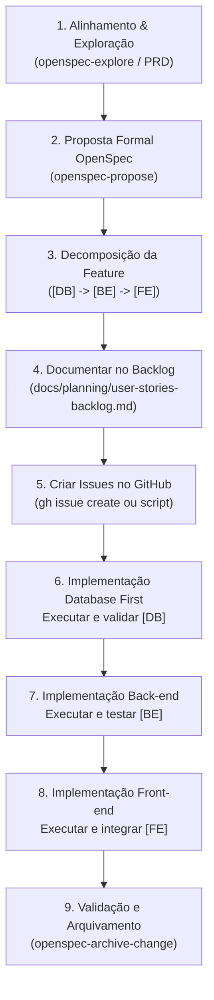

# Guia e Padrão de Histórias de Usuário e Tarefas (Backlog & Issues)

## Portal Empório Henz · Engenharia de Software e Governança

Este documento estabelece o **padrão oficial e obrigatório** para o planejamento, especificação, decomposição e criação de tarefas (Issues) no projeto Empório Henz para qualquer funcionalidade presente ou futura.

---

## 1. Princípios Fundamentais

### 1.1. Estratégia Database First (Garantia de Integridade)

> [!IMPORTANT]
> **O Banco de Dados sempre vem primeiro.**  
> Nenhum endpoint de back-end e nenhuma tela de front-end deve ser codificada antes que o esquema de dados correspondente no PostgreSQL esteja devidamente modelado, migrado e validado.

- **Por que Database First?**
  - Garante contratos de dados estáveis e imutáveis antes do consumo pelas APIs.
  - Elimina refatorações desnecessárias em rotas, DTOs e componentes visuais causadas por alterações tardias em tabelas ou tipos.
  - Assegura integridade referencial, constraints, soft delete (`deleted_at TIMESTAMP`) e índices parciais únicos desde o primeiro momento.

### 1.2. Decomposição Estrita por Camada Técnica

Toda e qualquer nova funcionalidade ou história de negócio que envolva persistência, lógica de servidor e interface com o usuário **DEVE ser dividida obrigatoriamente em tarefas (issues) separadas e independentes**:

1. **`[DB]` Banco de Dados** (`packages/database`): Tabelas, migrações `.sql`, chaves, constraints, soft delete e queries.
2. **`[BE]` Back-end** (`apps/backend`): Rotas em Bun nativo, middlewares, validação de payload, regras de negócio e códigos HTTP semânticos.
3. **`[FE]` Front-end** (`apps/web`): Telas Vue 3, SFCs, componentes, stores do Pinia, serviços em `src/api/` e estilização Figma.
4. **`[TEST]` Testes Automatizados** (quando aplicável): Casos de teste de integração e segurança com `bun:test`.
5. **`[INFRA]` Infraestrutura e Deploy** (quando aplicável): Docker Compose, proxy Nginx e scripts operacionais na VM.

---

## 2. Fluxo de Trabalho para Novas Features (Passo a Passo)



---

## 3. Template Oficial de História de Usuário (Para GitHub Issues e Docs)

Ao criar uma nova tarefa, utilize exatamente a estrutura abaixo:

```markdown
### 👤 História de Usuário

**Como** [Cliente / Vendedor / Administrador / Desenvolvedor / Avaliador]
**Quero** [Ação clara e objetiva que a pessoa deseja executar]
**Para que** [Valor real de negócio, benefício ou necessidade atendida]

---

### 📖 Contexto e Regras de Negócio

[Texto amplo, profundo e explicativo ("texto bem grande") contextualizando a necessidade, a relação com o PRD, a lógica de negócio do Empório Henz e o critério de avaliação ou impacto operacional.]

- Regra de Negócio 1
- Regra de Negócio 2
- Tratamentos de exceção e requisitos não-funcionais (segurança, performance)

---

### 🛠️ Especificação Técnica da Camada

<!-- SE FOR [DB]: -->

#### 🗄️ Banco de Dados (`packages/database`)

- **Tabelas / Migração**: Nome do arquivo `.sql` sequencial (ex.: `004_create_xyz.sql`).
- **Campos & Tipos**: Definição exata de colunas, tipos e valores default.
- **Soft Delete**: `deleted_at TIMESTAMP WITH TIME ZONE DEFAULT NULL`.
- **Índices**: Índices parciais de unicidade `WHERE deleted_at IS NULL`.

<!-- SE FOR [BE]: -->

#### ⚙️ Back-end (`apps/backend` - Bun nativo)

- **Rotas & Métodos**: Endpoint exato (`GET /api/...`, `POST /api/...`).
- **Middlewares**: Autenticação Bearer JWT, verificação de papéis (RBAC).
- **Contratos HTTP**: Códigos semânticos (`200 OK`, `201 Created`, `400 Bad Request`, `401 Unauthorized`, `403 Forbidden`, `404 Not Found`).

<!-- SE FOR [FE]: -->

#### 🎨 Front-end (`apps/web` - Vue 3 + Tailwind CSS v4)

- **Views & Componentes**: `src/views/...` e `src/components/...`.
- **Camada de Dados**: Módulo em `src/api/...` e store em `src/stores/...`.
- **UX/UI**: Tokens do Figma, estados reativos (`loading`, `error`, `success`) e validações de input.

---

### ✅ Critérios de Aceitação (Definition of Done)

- [ ] Critério técnico 1 verificável
- [ ] Critério técnico 2 verificável
- [ ] Teste ou validação manual comprovada
```

---

## 4. Convenção de Títulos, Tags e Labels

### 4.1. Prefixo Obrigatório no Título

- `[US-DB-XX] Nome Claro da Tarefa de Banco de Dados`
- `[US-BE-XX] Nome Claro da Tarefa de Back-end`
- `[US-FE-XX] Nome Claro da Tarefa de Front-end`
- `[US-TEST-XX] Nome Claro da Tarefa de Testes Automatizados`
- `[US-INFRA-XX] Nome Claro da Tarefa de Infraestrutura/VM`
- `[US-DOC-XX] Nome Claro da Tarefa de Documentação`
- `[US-ROB-XX] Nome Claro da Tarefa de Robustez e OpenSpec`

### 4.2. Matriz de Labels no GitHub

| Tag       | Label de Camada | Label de Tipo | Label de Prioridade |
| --------- | --------------- | ------------- | ------------------- |
| `[DB]`    | `database`      | `Feature`     | `p1` ou `p2`        |
| `[BE]`    | `backend`       | `Feature`     | `p1` ou `p2`        |
| `[FE]`    | `frontend`      | `Feature`     | `p1` ou `p2`        |
| `[TEST]`  | `test`          | `Feature`     | `p1` ou `p2`        |
| `[INFRA]` | `infra`         | `Feature`     | `p1` ou `p2`        |
| `[DOCS]`  | -               | `Docs`        | `p1` ou `p2`        |
| `[CHORE]` | -               | `Chore`       | `p1` ou `p2`        |

---

## 5. Como Criar Tarefas via Linha de Comando (CLI)

### 5.1. Criação Individual via `gh issue create`

```bash
gh issue create \
  --repo Joao-Camilo-Mallmann/site-emporio-henz \
  --title "[US-BE-99] Criar Endpoint de Exemplo" \
  --body-file ./caminho/para/descricao.md \
  --label "backend,Feature,p1" \
  --milestone "Parcial 1 - Apresentacao (Auth, 2 CRUDs, Figma, README)"
```

### 5.2. Criação em Lote via Script Bun

Para adicionar novas histórias em lote:

1. Adicione a nova seção `### [US-...` no arquivo [docs/planning/user-stories-backlog.md](./planning/user-stories-backlog.md).
2. Execute o script automatizado:
   ```bash
   bun scripts/create_issues.ts
   ```

---

## 6. Rastreabilidade com Git e OpenSpec

Para garantir o fechamento automático e a rastreabilidade no GitHub:

- Ao abrir uma branch para uma tarefa, use o formato:
  - `git checkout -b feature/issue-14-be-jwt-auth`
  - `git checkout -b database/issue-11-db-admin-seed`
- Ao realizar o commit ou Pull Request que finaliza a tarefa, inclua a instrução:
  - `git commit -m "feat(backend): implement JWT authentication utilities (Closes #14)"`
  - Isso fechará a issue correspondente no GitHub automaticamente quando o commit for integrado à branch principal.
