<!-- _class: brand-cover -->
<!-- _paginate: false -->

<div>


# Plataforma Digital de Móveis
### Apresentação Técnica · Parcial 1

**Engenharia de Software** · Avaliação de Entrega

**Equipe:**  
João Camilo Mallmann · Luiz Postal  
Cauã Primon · Airton Costa Junior

</div>

<div style="text-align: center;">

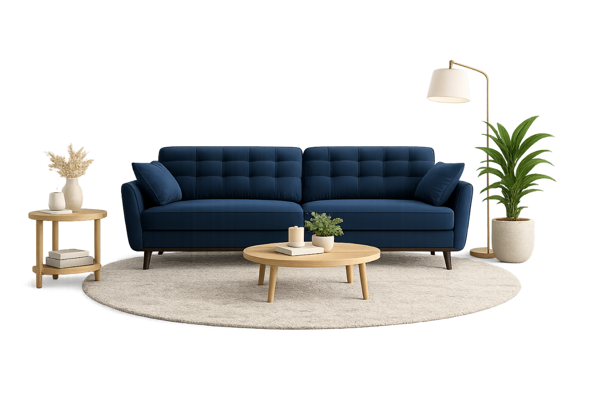

<p style="font-size: 13px; color: #cbd5e1; margin-top: 8px;">Design System Oficial · Fidelidade ao Figma</p>

</div>

---

## Sumário da Apresentação · <span>Roteiro da Parcial 1</span>

<div class="agenda-grid">

<div class="agenda-card">
  <div class="agenda-num">01 · Experiência do Cliente</div>
  <h4>Vitrine Digital & Institucional</h4>
  <p>Fidelidade aos protótipos do Figma, identidade visual e homenagem aos 50 anos de história.</p>
</div>

<div class="agenda-card">
  <div class="agenda-num">02 · Segurança & Sessão</div>
  <h4>Autenticação & Autocadastro</h4>
  <p>Hash Argon2id nativo, proteção JWT stateless, tratamento amigável de erro HTTP 401 e Pinia.</p>
</div>

<div class="agenda-card">
  <div class="agenda-num">03 · Módulos Operacionais</div>
  <h4>2 CRUDs Persistentes (PostgreSQL 16)</h4>
  <p>CRUD 1 (Usuários/Clientes) e CRUD 2 (Fornecedores/Marcas), com Soft Delete e reatividade.</p>
</div>

<div class="agenda-card">
  <div class="agenda-num">04 · Engenharia & Qualidade</div>
  <h4>Metodologia & Governança no GitHub</h4>
  <p>Database First, Kanban no GitHub Projects, GitFlow com +50 PRs e tipagem TypeScript 100% estrita.</p>
</div>

<div class="agenda-card">
  <div class="agenda-num">05 · Execução & Produção</div>
  <h4>Deploy Zero-Configuração, Demonstração na VPS & Lições Aprendidas</h4>
  <p>Ambiente em Docker Compose, convite para teste ao vivo na nuvem e desafios reais enfrentados.</p>
</div>

</div>

---

<!-- _class: page-proof -->

## Vitrine Digital · <span>Página inteira, fiel ao Figma</span>

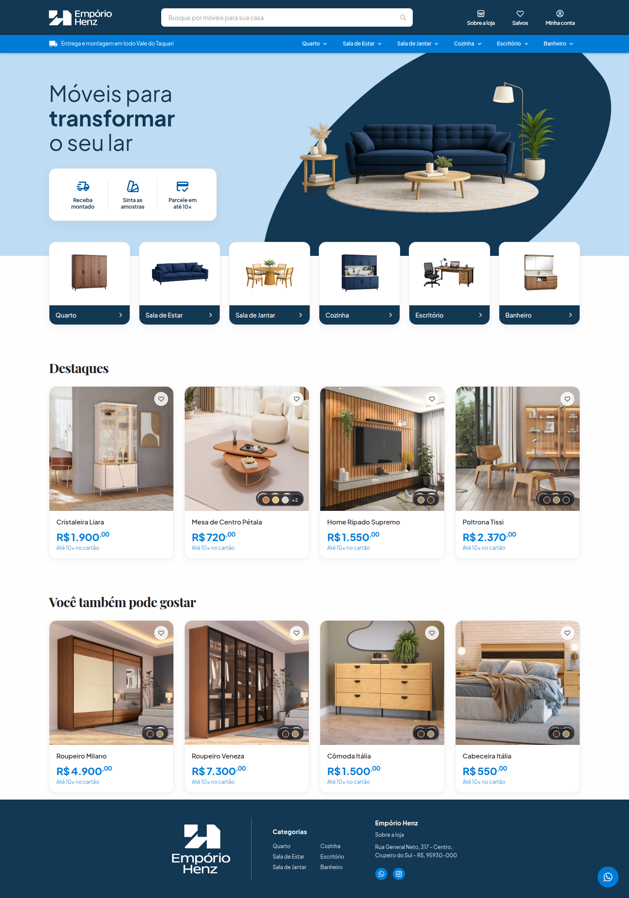

---

## Figma e a página final · <span>Mesmo enquadramento, lado a lado</span>

<div class="grid-2">
<div>

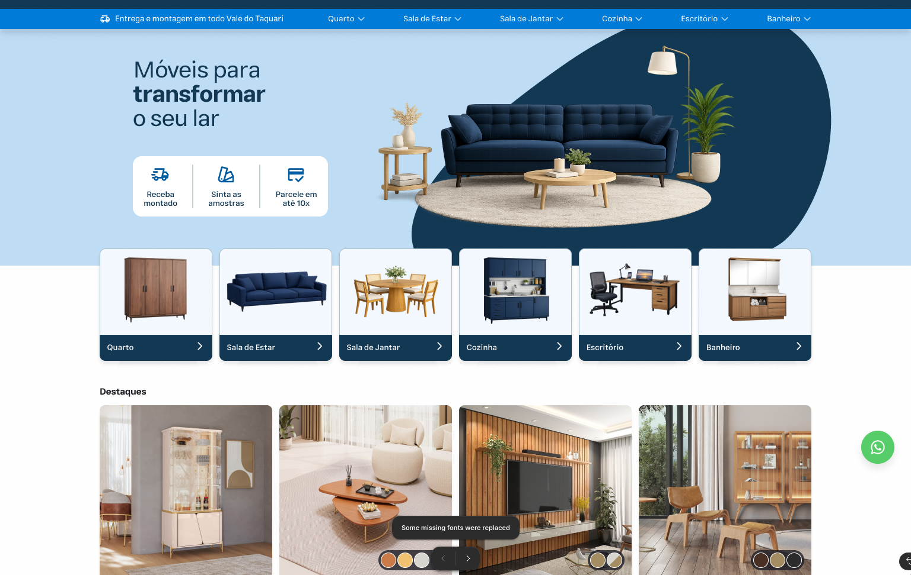
<div class="caption">Layout no Figma: hero, benefícios e categorias.</div>

</div>
<div>

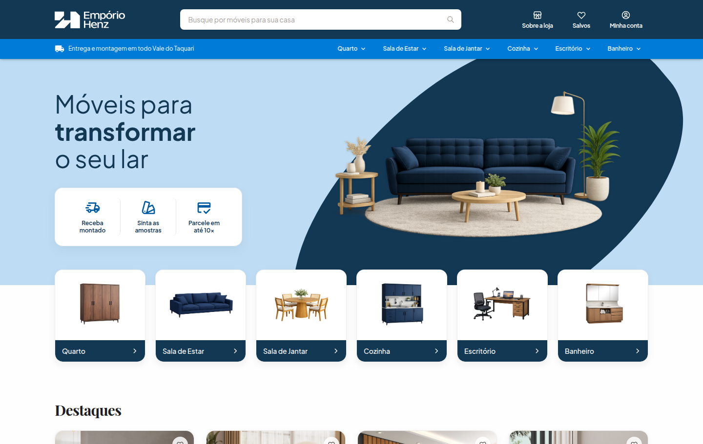
<div class="caption">Página final: a mesma faixa, já no site publicado.</div>

</div>
</div>

---

## Final da home · <span>Destaques, recomendações e rodapé</span>

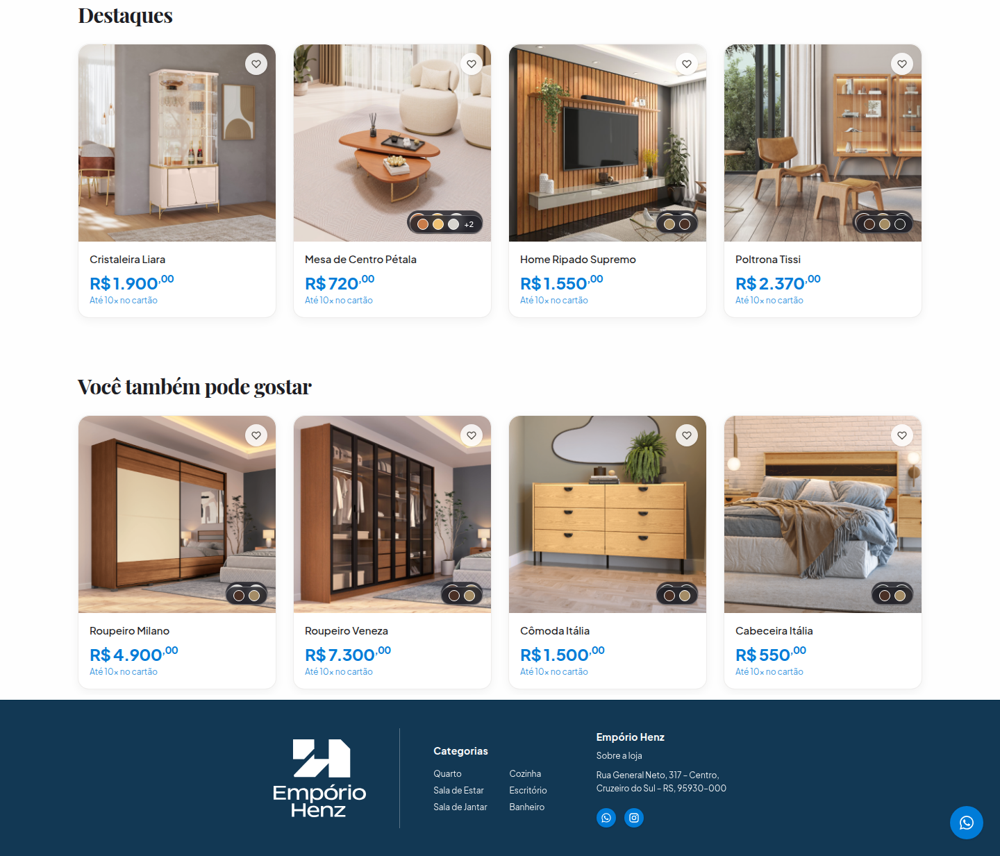

---

<!-- _class: page-proof -->

## Página Institucional · <span>Sobre a loja, página inteira</span>

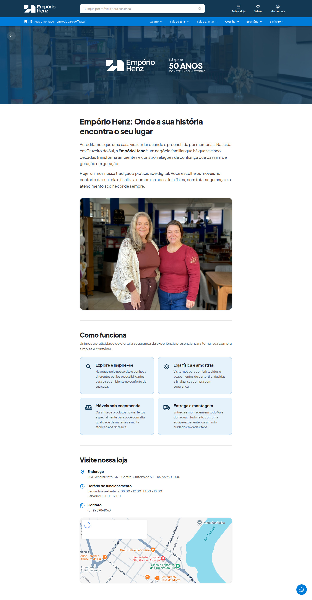

---

## Autenticação Segura · <span>Login com Argon2id e Feedback Visual de Erro</span>

<div class="grid-2">
<div>

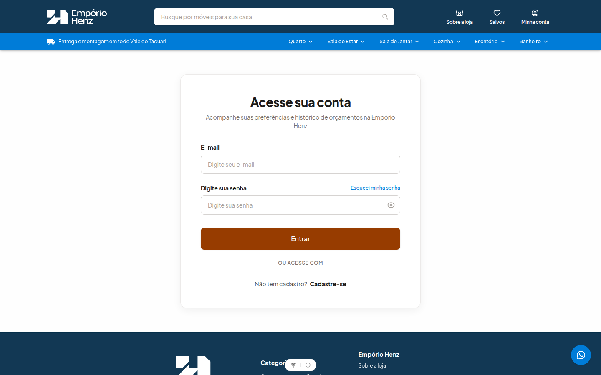
<div class="caption">1. Formulário de login com validação reativa e alternância de visibilidade.</div>

</div>
<div>

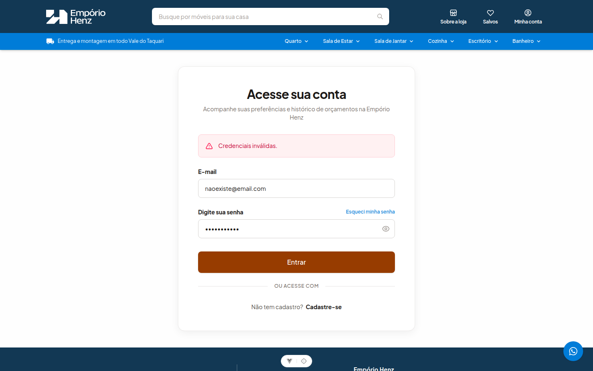
<div class="caption">2. Tratamento amigável de credenciais inválidas (HTTP 401 sem reload).</div>

</div>
</div>

**Segurança:** Hash de senha nativo no runtime Bun com Argon2id e controle de sessão stateless com Bearer JWT.

---

## Gestão de Sessão · <span>Autocadastro de Clientes e Store Pinia Ativa</span>

<div class="grid-2">
<div>

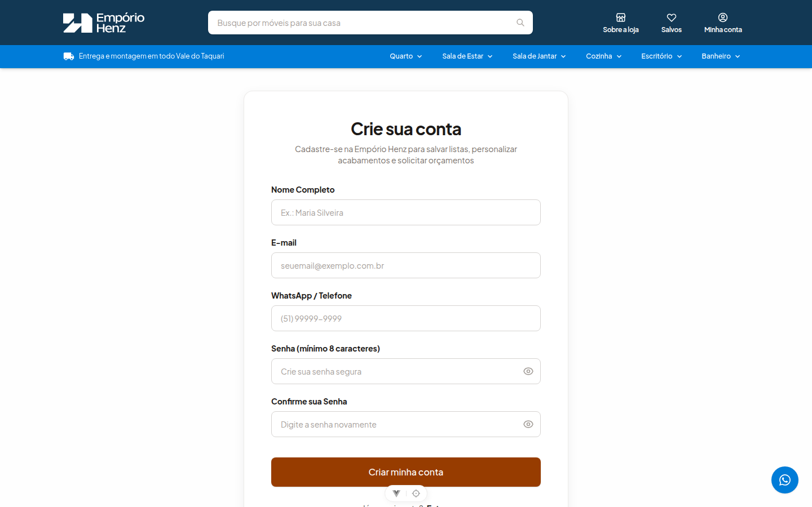
<div class="caption">1. Autocadastro com máscara dinâmica (51) 99999-9999 e validação de senha.</div>

</div>
<div>

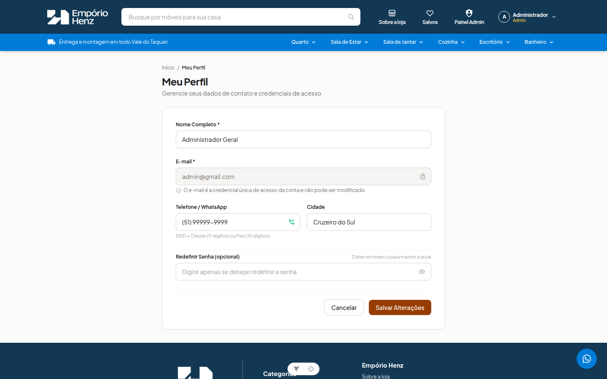
<div class="caption">2. Sessão ativa: cabeçalho com o administrador e dados em Meu Perfil.</div>

</div>
</div>

**Persistência Relacional:** Inserção simultânea em `users` e `clients`, token em `localStorage` e interceptor global Axios.

---

## Gestão Operacional no PostgreSQL 16 · <span>Sumário dos Dois CRUDs</span>

<div class="grid-2-asym">
<div>

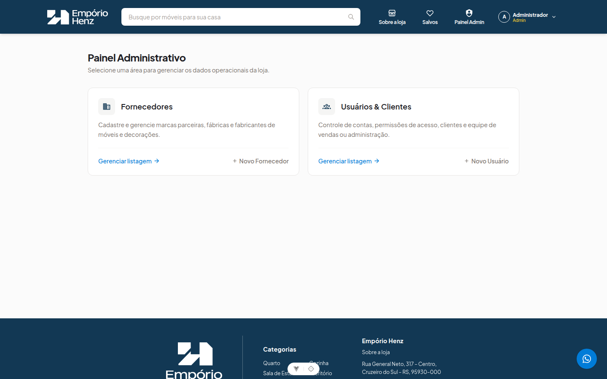
<div class="caption">Painel Administrativo: Hub central dividindo a gestão operacional da loja.</div>

</div>
<div>

<div class="module-card">
  <h4>Módulo 1 · Usuários & Clientes (CRUD 1)</h4>
  <p>• Gestão de contas e papéis (Admin, Funcionário, Cliente).<br>• Criação, listagem reativa, edição e Soft Delete.</p>
</div>

<div class="module-card module-card-alt">
  <h4>Módulo 2 · Fornecedores & Marcas (CRUD 2)</h4>
  <p>• Gestão de fábricas e fabricantes de móveis.<br>• Notificações toast em tempo real e integridade de catálogo.</p>
</div>

<div class="info-box" style="margin-top: 6px;">
  <p><b>RNF08 Estrito:</b> Exclusão lógica (<code>deleted_at</code>) padronizada em ambos os módulos.</p>
</div>

</div>
</div>

---

<span class="badge-module">CRUD 1 · Usuários & Clientes</span>

## CRUD 1 em Ação · <span>Cadastro de Usuário e Inclusão Imediata no Banco</span>

<div class="grid-2">
<div>

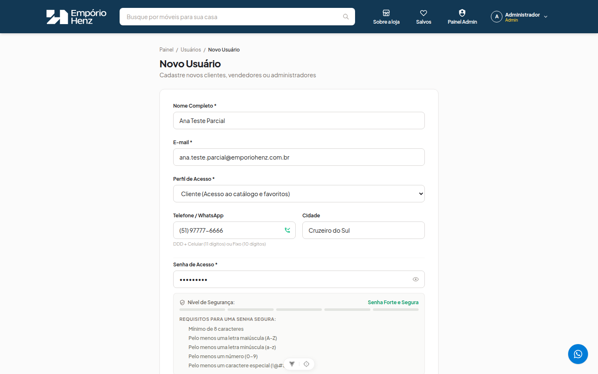
<div class="caption">1. Formulário preenchido com validação de senha forte (POST /api/clientes).</div>

</div>
<div>

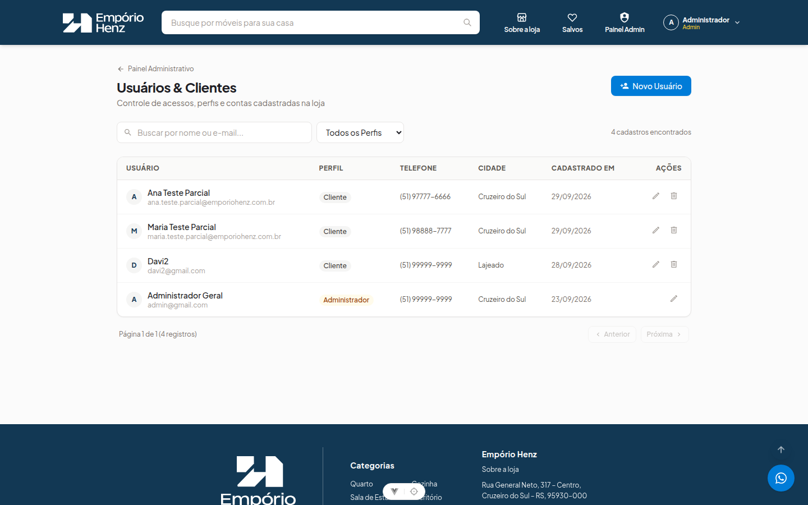
<div class="caption">2. Novo usuário persistido na listagem em tempo real (Ana Teste Parcial).</div>

</div>
</div>

<div class="info-box">
<p><b>Persistência no PostgreSQL 16:</b> Inserção atômica com hash Argon2id; a reatividade do Vue 3 reflete o novo registro no topo da tabela sem necessidade de recarregar a tela.</p>
</div>

---

<span class="badge-module">CRUD 1 · Usuários & Clientes</span>

## CRUD 1 Gestão · <span>Edição Cadastral e Exclusão Lógica com Soft Delete</span>

<div class="grid-2">
<div>

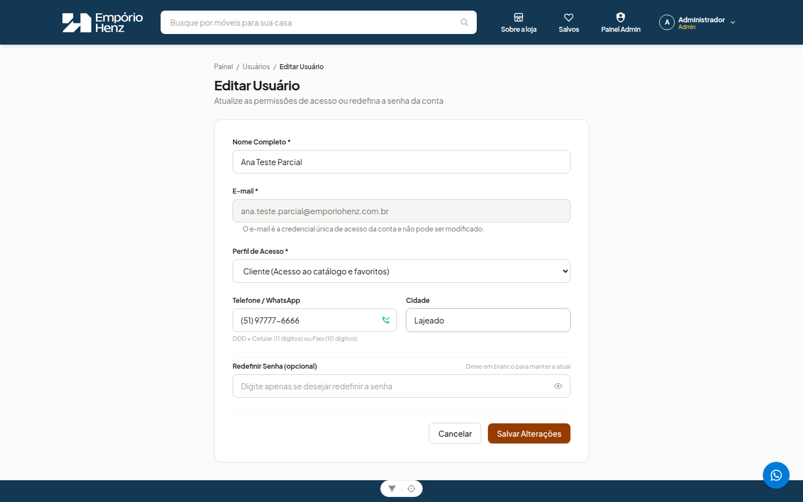
<div class="caption">1. Modal de edição de dados cadastrais (telefone, cidade e permissão).</div>

</div>
<div>

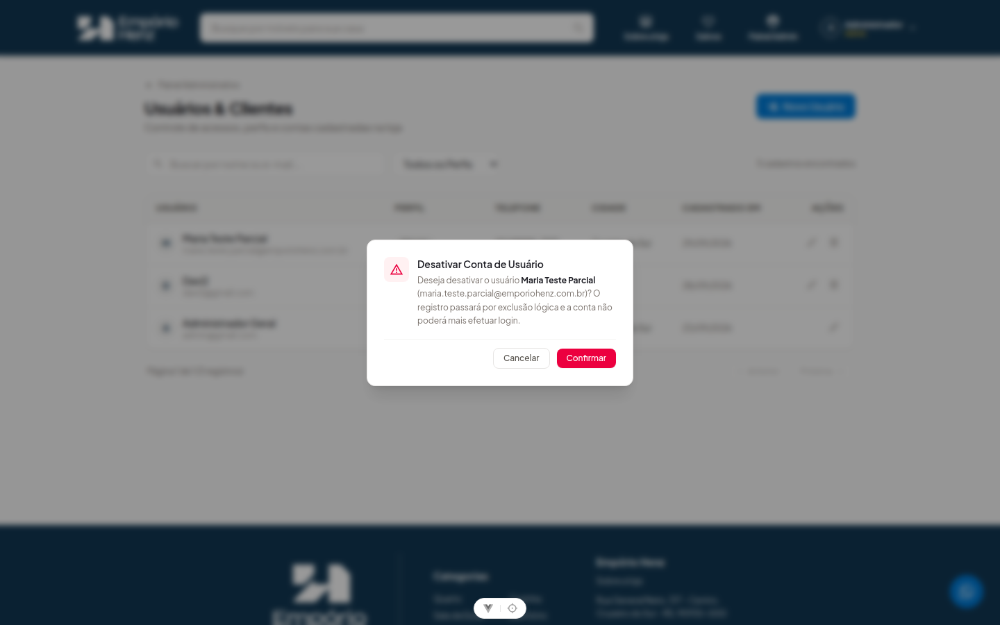
<div class="caption">2. Modal de confirmação de exclusão lógica (Soft Delete RNF08).</div>

</div>
</div>

<div class="info-box">
<p><b>Soft Delete (RNF08):</b> O endpoint <code>DELETE</code> preenche <code>deleted_at</code> sem apagar histórico; o índice parcial único <code>idx_users_email_active</code> garante que contas inativas liberem o e-mail para eventuais recadastros.</p>
</div>

---

<span class="badge-module badge-module-alt">CRUD 2 · Fornecedores Parceiros</span>

## CRUD 2 em Ação · <span>Cadastro de Marca com Feedback Toast em Tempo Real</span>

<div class="grid-2">
<div>

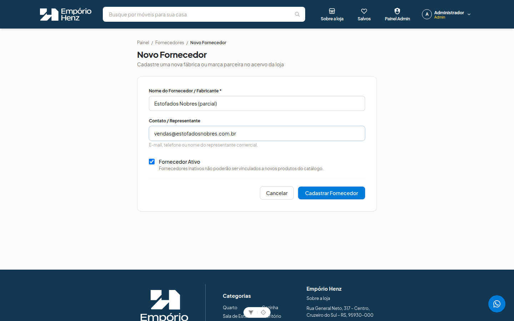
<div class="caption">1. Formulário preenchido com razão social e contato da fábrica parceira.</div>

</div>
<div>


<div class="caption">2. Estofados Nobres já na listagem, com status Ativo, sem recarregar a tela.</div>

</div>
</div>

<div class="info-box">
<p><b>Reatividade & Feedback Visual:</b> Endpoint <code>POST /api/fornecedores</code> persistido no PostgreSQL 16 com toast imediato via biblioteca <code>vue3-toastify</code> e listagem reativa.</p>
</div>

---

<span class="badge-module badge-module-alt">CRUD 2 · Fornecedores Parceiros</span>

## CRUD 2 Gestão · <span>Edição Comercial e Integridade Referencial</span>

<div class="grid-2">
<div>

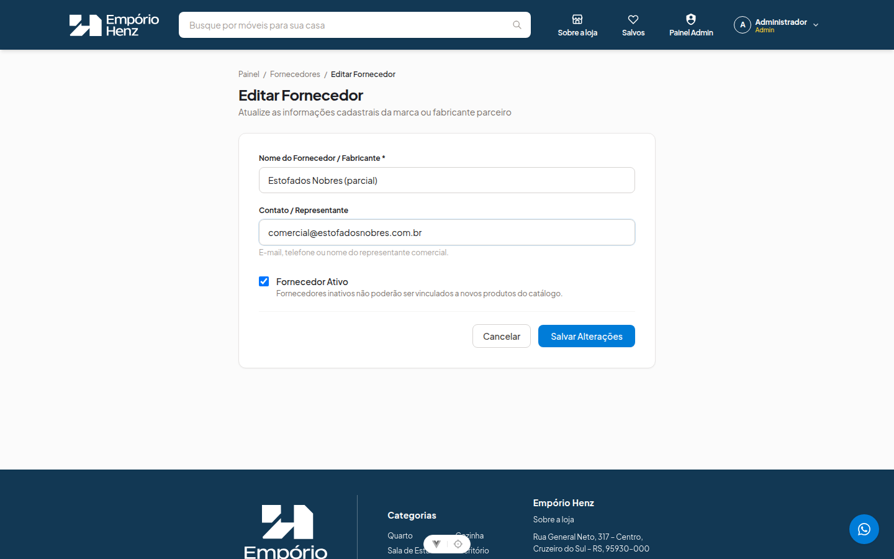
<div class="caption">1. Edição de contatos comerciais, representantes e dados da marca parceira.</div>

</div>
<div>

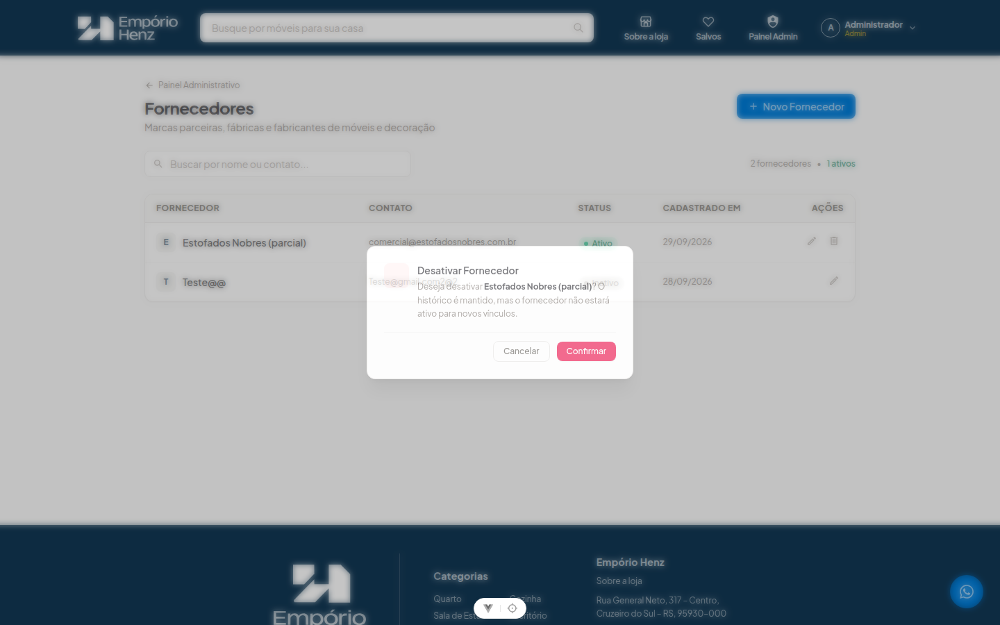
<div class="caption">2. Modal de confirmação de desativação lógica preservando o histórico.</div>

</div>
</div>

<div class="info-box">
<p><b>Integridade Referencial:</b> A inativação lógica via Soft Delete impede violações de chave estrangeira (<code>supplier_id</code>) no mostruário de produtos e pedidos históricos da loja.</p>
</div>

---

## Metodologia de Trabalho · <span>Database First e Engenharia de Requisitos</span>

<div class="grid-2">
<div>

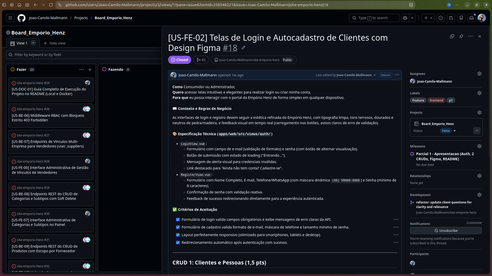
<div class="caption">Quadro Kanban da Sprint no GitHub Projects.</div>

</div>
<div>

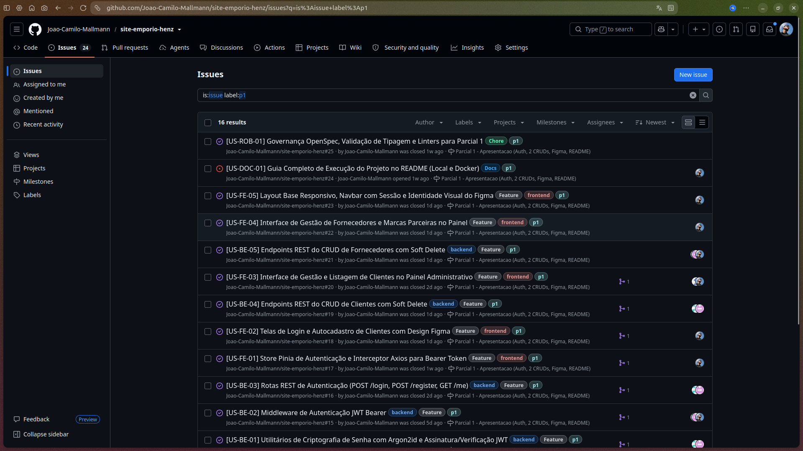
<div class="caption">Issue formal com critérios de aceitação e camada técnica.</div>

</div>
</div>

**Engenharia de Processo:** Backlog e sprints organizados via Kanban no GitHub Projects, issues formais com critérios de aceitação e modelagem Database First no PostgreSQL 16.

---

## Governança do Código · <span>GitFlow com Mais de 50 Pull Requests Revisados</span>

<div class="grid-2">
<div>

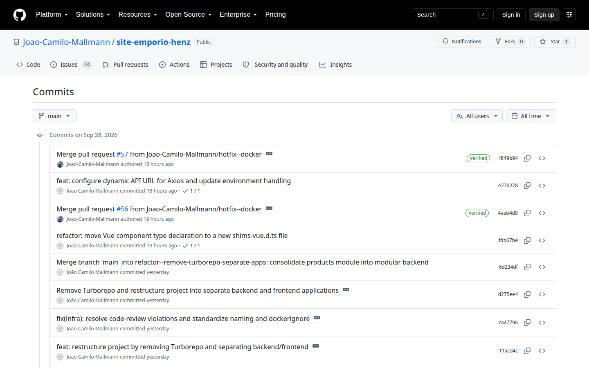
<div class="caption">Histórico de Conventional Commits (feat:, fix:).</div>

</div>
<div>

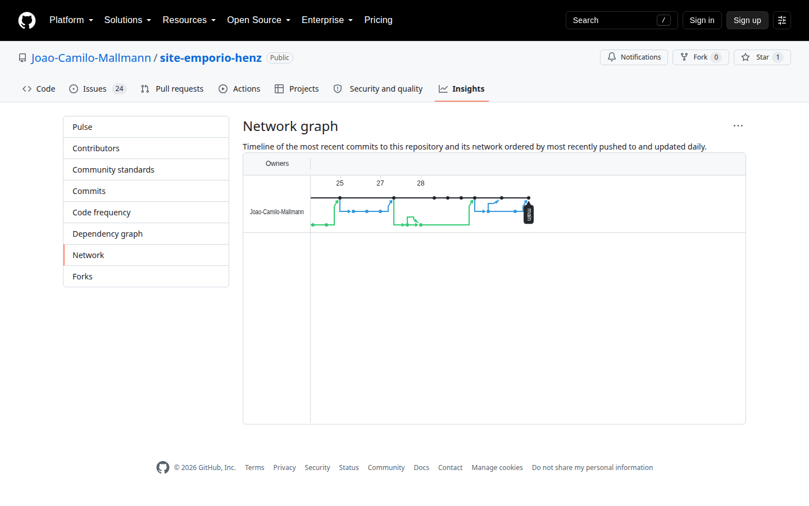
<div class="caption">Network Graph de branches convergentes.</div>

</div>
</div>

**Governança:** Mais de 50 Pull Requests revisados por pares e zero erros de TypeScript e ESLint.

---

## Facilidade de Execução · <span>Ambiente Completo Subindo em Um Comando</span>

```bash
# 1. Configurar variáveis de ambiente
cp .env.example .env

# 2. Modo Desenvolvimento com Live-Reload (HMR)
docker compose --profile dev up -d
# Frontend: :3000 | Backend: :3001

# 3. Modo Produção Compilado (Nginx na porta 80)
docker compose --profile prod up -d --build
```

**Portabilidade Total:** Setup zero-configuração via Docker Compose, com migrações SQL automáticas e banco semeado.

---

<!-- _class: live-vps -->
<!-- _paginate: false -->

<span class="pill-production">Ambiente de Produção · Nuvem</span>

# Venha Ver Ao Vivo na Nossa VPS!
### Convidamos o Professor e a Banca para Testarem Agora em Tempo Real

<div class="vps-url-box">
http://177.44.248.90/
</div>

<p style="font-size: 16px; color: #e0f2fe; margin-top: 8px; max-width: 860px; line-height: 1.45;">
A plataforma está <b>compilada e no ar</b>. Abram o endereço no navegador durante a apresentação.
</p>

<div class="tech-pills">
<div>Docker Compose Produção</div>
<div>Nginx · porta 80</div>
<div>PostgreSQL 16 Nativo</div>
<div>Bun Nativo + Vue 3 SPA</div>
</div>

---

## Lições Aprendidas · <span>Desafios Reais de Infraestrutura, Segurança e Governança</span>

<div class="grid-2">
<div>

<div class="lesson-card">
  <h4>1. Esforço Documental ("Documental Caro")</h4>
  <p>Manter PRD, DER, issues no GitHub e código real alinhados demandou alto tempo e esforço.<br><b>Aprendizado:</b> Garantiu rastreabilidade total: tudo foi implementado sem retrabalho.</p>
</div>

<div class="lesson-card alt">
  <h4>2. Docker e Subir para a VM</h4>
  <p>Dificuldade de testar na VM remota e separar com precisão ambientes de <b>desenvolvimento</b> (Live-Reload) e <b>produção</b> (Nginx proxy reverso).<br><b>Aprendizado:</b> Setup estabilizado em um comando via <code>docker-compose.yml</code>.</p>
</div>

</div>
<div>

<div class="lesson-card">
  <h4>3. Codificação e Detalhes de Segurança</h4>
  <p>Ajustes minuciosos que parecem simples na teoria mas exigiram atenção fina: expiração de JWT, variáveis seguras, isolamento de rede do PostgreSQL na VPS e CORS.</p>
</div>

<div class="lesson-card alt">
  <h4>4. Backend Bun Nativo vs. Framework</h4>
  <p>Escolha de usar Bun nativo puro (<code>Bun.serve</code>) deu altíssima performance e controle.<br><b>Reflexão:</b> Exigiu criar roteamento na mão; um micro-framework poderia ter agilizado a entrega.</p>
</div>

</div>
</div>

---

<!-- _class: brand-closing -->
<!-- _paginate: false -->


# Obrigado!
### Espaço Aberto para Perguntas da Banca (5 Minutos)

**Empório Henz:** João Camilo Mallmann · Luiz Postal · Cauã Primon · Airton Costa Junior

**Ambiente Operando:** `http://177.44.248.90/`  
**Repositório:** `site-emporio-henz`
