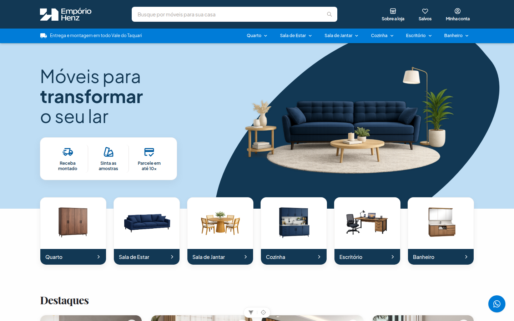

<!-- _class: lead -->
<!-- _paginate: false -->
# 🏛️ Empório Henz
### Plataforma Digital de Móveis · **Apresentação Parcial 1**

**Engenharia de Software** · Apresentação de Entrega e Avaliação da Parcial 1

**Equipe:** João Camilo Mallmann · Luiz Postal · Cauã Primon · Airton Costa Junior

---

## Vitrine Digital · <span>Fidelidade aos Protótipos do Figma</span>



**Interface Web:** Vue 3 + Tailwind CSS v4, identidade visual refinada e homenagem aos 50 anos de história.

---

## Página Institucional · <span>Homenagem aos 50 Anos e a Reconstrução</span>


**História de Superação:** Trajetória da família Henz pós-enchente histórica no Vale do Taquari.

---

## Autenticação Segura · <span>Login com Argon2id e Feedback Visual de Erro</span>

<div class="grid-2">
<div>


<div class="caption">1. Formulário de login com validação reativa.</div>

</div>
<div>


<div class="caption">2. Tratamento amigável de credenciais inválidas (HTTP 401).</div>

</div>
</div>

**Segurança:** Hash nativo do runtime Bun e middleware de proteção Bearer JWT.

---

## Gestão de Sessão · <span>Autocadastro de Clientes e Store Pinia Ativa</span>

<div class="grid-2">
<div>


<div class="caption">1. Cadastro com máscara dinâmica (51) 99999-9999.</div>

</div>
<div>


<div class="caption">2. Home autenticada reconhecendo o usuário via Pinia.</div>

</div>
</div>

**Persistência:** Inserção simultânea em `users` e `clients` e Bearer JWT em `localStorage`.

---

## Rápido Sumário no Meio · <span>Painel Administrativo & Os Dois CRUDs</span>

<div class="grid-2-asym">
<div>


<div class="caption">Painel Administrativo: Hub central dividindo a gestão operacional.</div>

</div>
<div>

<span class="tag tag-accent">Sumário da Demonstração</span>

### Gestão Operacional no PostgreSQL 16

* **Módulo 1 · Usuários & Clientes (CRUD 1):**
  * Tabela `users` & `clients` com papéis de acesso.
  * Autonomia de cadastro, edição e **Soft Delete**.
* **Módulo 2 · Fornecedores & Marcas (CRUD 2):**
  * Tabela `suppliers` com dados comerciais.
  * Notificações toast instantâneas e integridade referencial.
* **RNF08 Estrito:** Exclusão lógica (`deleted_at`) em ambos.

</div>
</div>

---

<!-- _class: divider -->
<!-- _paginate: false -->

<span class="tag tag-accent">SEÇÃO 01 · INÍCIO DO CRUD 1</span>

# CRUD 1: Gestão de Usuários & Clientes
## Início da Demonstração · Criação, Leitura, Edição e Desativação Lógica

<div class="grid-2">
<div class="op-card">

* **[C] Create:** Cadastro de novos clientes e colaboradores com perfil de acesso e validação de senha forte.
* **[R] Read:** Listagem reativa com paginação e busca instantânea com debounce por nome e e-mail.

</div>
<div class="op-card">

* **[U] Update:** Atualização de contatos, cidade e permissões cadastrais.
* **[D] Delete:** **Soft Delete (RNF08)** via `deleted_at = CURRENT_TIMESTAMP` com índice parcial único.

</div>
</div>

---

## CRUD 1 em Ação · <span>Cadastro de Usuário e Inclusão Imediata no Banco</span>

<div class="grid-2">
<div>


<div class="caption">1. Formulário preenchido com validação de senha forte (POST /api/clientes).</div>

</div>
<div>


<div class="caption">2. Novo usuário persistido na listagem em tempo real (Ana Teste Parcial).</div>

</div>
</div>

**Persistência no PostgreSQL 16:** A listagem reflete o novo registro imediatamente sem reload da página.

---

## CRUD 1 Gestão · <span>Edição Cadastral e Exclusão Lógica (Soft Delete)</span>

<div class="grid-2">
<div>


<div class="caption">1. Modal de edição de dados cadastrais (telefone, cidade e permissão).</div>

</div>
<div>


<div class="caption">2. Modal de confirmação de exclusão lógica (Soft Delete).</div>

</div>
</div>

**Soft Delete (RNF08):** O endpoint `DELETE` inativa o registro sem apagar histórico; índice parcial único permite reuso futuro.

---

<!-- _class: divider -->
<!-- _paginate: false -->

<span class="tag tag-success">✓ CRUD 1 CONCLUÍDO</span> &nbsp; <span class="tag tag-accent">SEÇÃO 02 · INÍCIO DO CRUD 2</span>

# CRUD 2: Fornecedores & Fábricas Parceiras
## Início da Demonstração · Cadastro com Toast, Listagem Ativa e Integridade

<div class="grid-2">
<div class="op-card">

* **[C] Create:** Cadastro de marcas e indústrias parceiras com notificação toast instantânea (`vue3-toastify`).
* **[R] Read:** Listagem de marcas ativas com contatos comerciais e status operacional em tempo real.

</div>
<div class="op-card">

* **[U] Update:** Atualização de canais de atendimento, representantes e razão social da fábrica.
* **[D] Delete:** **Soft Delete** preservando chaves estrangeiras (`supplier_id`) no mostruário de produtos.

</div>
</div>

---

## CRUD 2 em Ação · <span>Cadastro de Marca Parceira com Toast em Tempo Real</span>

<div class="grid-2">
<div>


<div class="caption">1. Formulário de cadastro preenchido com dados da fábrica parceira.</div>

</div>
<div>


<div class="caption">2. Fornecedor persistido na tabela com notificação toast verde de sucesso.</div>

</div>
</div>

**Reatividade:** Feedback visual verde via `vue3-toastify` e persistência imediata no PostgreSQL 16.

---

## CRUD 2 Gestão · <span>Edição Comercial e Integridade Referencial</span>

<div class="grid-2">
<div>


<div class="caption">1. Edição de contatos comerciais, representantes e dados da marca.</div>

</div>
<div>


<div class="caption">2. Modal de confirmação de desativação lógica sem afetar produtos vinculados.</div>

</div>
</div>

**Integridade Referencial:** Inativação lógica (`deleted_at`) que impede a quebra de chaves estrangeiras no mostruário.

---

## Síntese dos CRUDs · <span>100% de Conformidade com o Edital e Requisitos</span>

<table class="comp-table">
  <thead>
    <tr>
      <th>Critério / Recurso</th>
      <th>CRUD 1: Usuários & Clientes</th>
      <th>CRUD 2: Fornecedores & Marcas</th>
      <th>Status Parcial 1</th>
    </tr>
  </thead>
  <tbody>
    <tr>
      <td><b>Persistência Relacional</b></td>
      <td>Tabelas <code>users</code> e <code>clients</code></td>
      <td>Tabela <code>suppliers</code></td>
      <td>✅ Persistente no PostgreSQL 16</td>
    </tr>
    <tr>
      <td><b>Operações C-R-U-D</b></td>
      <td>Create, Read, Update, Delete</td>
      <td>Create, Read, Update, Delete</td>
      <td>✅ 100% Operacional</td>
    </tr>
    <tr>
      <td><b>Soft Delete (RNF08)</b></td>
      <td><code>deleted_at</code> + Índice Parcial Único</td>
      <td><code>deleted_at</code> + Preservação de FK</td>
      <td>✅ Em Conformidade</td>
    </tr>
    <tr>
      <td><b>Feedback Visual na UI</b></td>
      <td>Atualização reativa em tempo real</td>
      <td>Notificação Toast (<code>vue3-toastify</code>)</td>
      <td>✅ Testado e Validado</td>
    </tr>
    <tr>
      <td><b>Segurança / Acesso</b></td>
      <td>Argon2id + Validação de Senha Forte</td>
      <td>Controle de contatos comerciais</td>
      <td>✅ Implementado</td>
    </tr>
  </tbody>
</table>

<div class="info-box">
<p><b>Transição da Apresentação:</b> Com ambos os CRUDs validados de ponta a ponta no banco de dados e na interface, apresentamos a governança e a engenharia de processo do projeto.</p>
</div>

---

## Metodologia de Trabalho · <span>Database First e Gestão Nominal de Tarefas</span>

<div class="grid-2">
<div>


<div class="caption">Quadro Kanban da Sprint no GitHub Projects.</div>

</div>
<div>


<div class="caption">Issue formal com critérios de aceitação e camada técnica.</div>

</div>
</div>

**Divisão Nominal:** João Camilo (Full Stack/Docker), Luiz Postal (DER/PRD), Cauã Primon (Domínio/Testes), Airton Junior (QA/PRs).

---

## Governança do Código · <span>GitFlow com Mais de 50 Pull Requests Revisados</span>

<div class="grid-2">
<div>


<div class="caption">Histórico de Conventional Commits (feat:, fix:).</div>

</div>
<div>


<div class="caption">Network Graph de branches convergentes.</div>

</div>
</div>

**Governança:** Mais de 50 Pull Requests revisados por pares e zero erros de TypeScript e ESLint.

---

## Facilidade de Execução · <span>Ambiente Completo Subindo em Um Comando</span>

```bash
# 1. Configurar variáveis de ambiente
cp .env.example .env

# 2. Modo Desenvolvimento com Live-Reload (HMR)
docker compose --profile dev up -d
# Frontend: :3000 | Backend: :3001

# 3. Modo Produção Compilado (Nginx na porta 80)
docker compose --profile prod up -d --build
```

**Portabilidade Total:** Setup zero-configuração via Docker Compose, com migrações SQL automáticas e banco semeado.

---

<!-- _class: live-demo -->
<!-- _paginate: false -->

<span class="tag-cherry">🍒 CEREJA DO BOLO · AMBIENTE REAL DE PRODUÇÃO</span>

# 🌐 Venha Ver Ao Vivo na Nossa VPS!
### Convidamos o Professor e a Banca para Testarem Agora em Tempo Real

<div class="url-box">
http://177.44.248.90/
</div>

<p style="font-size: 17px; color: #e0f2fe; margin-top: 10px; max-width: 860px; line-height: 1.5;">
Tudo o que apresentamos não ficou apenas em ambiente local: nossa plataforma inteira está <b>compilada, implantada e operando ao vivo</b> na VPS pública na nuvem! Podem acessar pelo navegador ou smartphone agora mesmo.
</p>

<div class="grid-tech">
<div>🐳 Docker Compose Produção</div>
<div>🌐 Nginx Proxy Reverso (Porta 80)</div>
<div>🐘 PostgreSQL 16 Nativo</div>
<div>⚡ Bun Nativo + Vue 3 SPA</div>
</div>

<div class="credentials-box">
🔑 <b>Acesso Admin Pré-Cadastrado:</b> <code>admin@gmail.com</code> &nbsp;|&nbsp; <b>Senha:</b> <code>admin123</code>
</div>

---

## Lições Aprendidas · <span>Desafios Reais de Infraestrutura, Segurança e Governança</span>

<div class="grid-2">
<div>

### 1. Esforço Documental ("Documental Caro")
* Manter PRD, DER, issues no GitHub e código real rigorosamente alinhados demandou alto tempo e esforço.
* **Aprendizado:** Garantiu rastreabilidade total: tudo o que foi planejado foi implementado sem retrabalho.

### 2. Docker e Subir para a VM
* Dificuldade de testar na VM remota e separar com precisão os ambientes de **desenvolvimento** (Live-Reload) e de **produção** (Nginx proxy reverso).
* **Aprendizado:** Setup estabilizado em um único comando via `docker-compose.yml`.

</div>
<div>

### 3. Codificação e Detalhes de Segurança
* Ajustes minuciosos que parecem simples na teoria ("problemas bobos"), mas foram trabalhosos de alinhar:
* Expiração de JWT, variáveis de ambiente seguras, isolamento de rede do PostgreSQL na VPS (sem expor portas) e CORS.

### 4. Backend Bun Nativo vs. Framework
* Escolha de usar Bun nativo puro (`Bun.serve`) sem Express ou Nest deu altíssima performance e controle.
* **Reflexão:** Exigiu criar roteamento e validações na mão. Um framework talvez pudesse ter agilizado a entrega inicial.

</div>
</div>

---

<!-- _class: lead -->
# Obrigado!
### Espaço Aberto para Perguntas da Banca (5 Minutos)

**Empório Henz:** João Camilo · Luiz Postal · Cauã Primon · Airton Junior

🌐 **Sistema Operando:** `http://177.44.248.90/`  
📁 **Repositório:** `site-emporio-henz`
